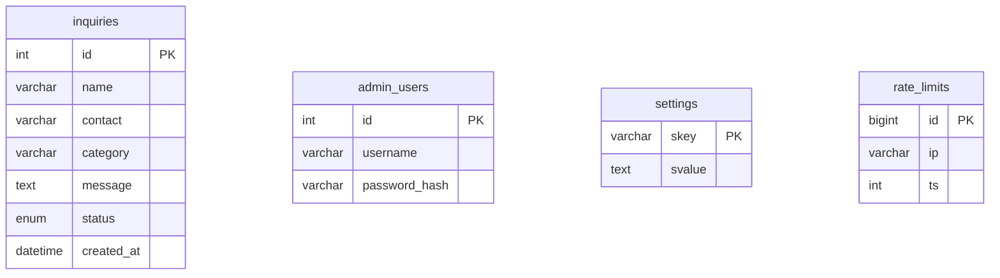

# 데이터베이스 스키마

- **운영**: MySQL 5.7+ / MariaDB (`backend/schema.sql`로 생성)
- **로컬**: SQLite (`setup-local.php`가 동등 구조로 생성)
- 문자셋: `utf8mb4` (이모지·다국어 안전)
- 접근: 모두 PDO **Prepared Statement** 사용 (SQL 인젝션 방지)

## 테이블 목록

| 테이블 | 용도 |
|--------|------|
| `inquiries` | 상담신청(문의) 접수 내역 |
| `admin_users` | 관리자 계정 |
| `settings` | 사이트 설정(이메일 알림 등) key-value |
| `rate_limits` | IP별 요청 기록(스팸/과다요청 차단) |

---

## inquiries — 상담신청 접수

| 컬럼 | 타입 | 설명 |
|------|------|------|
| `id` | INT PK AI | 문의 번호 |
| `name` | VARCHAR(100) | 성함 |
| `contact` | VARCHAR(100) | 연락처/SNS ID |
| `category` | VARCHAR(50) | 문의내용(상담부위) — 폼 select 값 |
| `message` | TEXT | 추가 문의내용(선택) |
| `source_page` | VARCHAR(255) | 접수된 페이지 URL |
| `ip` | VARCHAR(45) | 접수 IP |
| `user_agent` | VARCHAR(255) | 브라우저 정보 |
| `status` | ENUM(new/doing/done) | 처리상태(신규/처리중/완료) |
| `admin_memo` | TEXT | 관리자 메모 |
| `created_at` | DATETIME | 접수일시(기본값 현재시각) |

- 인덱스: `status`, `created_at`
- 상담부위(category) 허용값 18종: 눈성형·코성형·안면윤곽·동안성형·가슴성형·지방흡입·보톡스/필러·기미/주근깨/홍조·여드름/여드름흉터·모공/흉터·주름/리프팅·제모/문신제거·피부질환·비만·두피/탈모/모발이식·메디컬 에스테틱·기타 피부·기타 성형
  - 이 목록은 `site/backend/submit.php`의 `ALLOWED_CATEGORIES` 상수와 프론트 폼 `<select>`가 일치해야 합니다.

## admin_users — 관리자 계정

| 컬럼 | 타입 | 설명 |
|------|------|------|
| `id` | INT PK AI | |
| `username` | VARCHAR(50) UNIQUE | 관리자 아이디 |
| `password_hash` | VARCHAR(255) | `password_hash()` 해시 (평문 저장 안 함) |
| `display_name` | VARCHAR(100) | 표시 이름 |
| `created_at` | DATETIME | |

- 기본 계정: `admin` / `jkwithme!2026` (**운영 배포 시 즉시 변경**)
- 계정 추가: `INSERT` 시 비밀번호는 반드시 `password_hash('원하는비번', PASSWORD_DEFAULT)` 결과를 넣습니다.

## settings — 사이트 설정 (key-value)

| skey | 설명 | 기본값 |
|------|------|--------|
| `notify_enabled` | 이메일 알림 사용(1/0) | 1 |
| `notify_emails` | 알림 수신 이메일(쉼표/줄바꿈 다수) | famdeju06@gmail.com, famdeju02@naver.com |
| `mail_method` | 발송방식 `mail`/`smtp` | mail |
| `from_name` | 발신자 이름 | JK위드미 홈페이지 |
| `from_email` | 발신 이메일(비우면 no-reply@도메인) | (빈값) |
| `smtp_host` `smtp_port` `smtp_secure` `smtp_user` `smtp_pass` | SMTP 접속정보 | (빈값)/465/ssl |

## rate_limits — 요청 제한 기록

| 컬럼 | 타입 | 설명 |
|------|------|------|
| `id` | BIGINT PK AI | |
| `ip` | VARCHAR(45) | 요청 IP |
| `ts` | INT (UNIX초) | 요청 시각(타임존 무관) |

- 인덱스: `(ip, ts)`
- 정책: 같은 IP가 **10분(600초)에 5건** 초과 시 차단(HTTP 429). `site/backend/submit.php`에서 사용.
- 오래된 기록은 접수 시 자동 청소.

---

## ER 개념도

> 테이블 간 외래키 관계는 없습니다(단순 구조). 관리자·설정·레이트리밋·문의는 서로 독립적으로 동작합니다.
